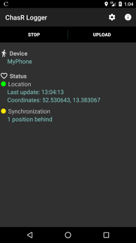

[ChasR is an open-source end-to-end encrypted GPS tracking system](https://alertr.de/chasr). It can be used directly as [service](https://alertr.de/chasr) or hosted by oneself. The goal of ChasR is to offer a privacy protecting GPS tracking service by using end-to-end encryption. This means that the sensitive location data of a user is directly encrypted on the device before it is sent to the server. Since the server does not know the key for the encryption, it cannot see the location data. The stored location data can be accessed either via Android App or web interface. Again, the location data is decrypted on the device and hence the server has no way of knowing the location of the user. All you need to use ChasR is a [free account](https://alertr.de/register) and ChasR logging application.

The ChasR GPS Tracking System is separated into multiple components:

* ChasR Server ([Github](https://github.com/sqall01/chasr-server) | [Service](https://alertr.de/chasr))
* ChasR Android Logger ([Github](https://github.com/sqall01/chasr-android-logger) | [Google Play](https://play.google.com/store/apps/details?id=de.alertr.chasr))
* ChasR Android Map ([Github](https://github.com/sqall01/chasr-android-map) | [Google Play](https://play.google.com/store/apps/details?id=de.alertr.chasrmap))
* ChasR Linux Logger ([Github](https://github.com/sqall01/chasr-linux-logger))

Additionally, the ChasR GPS Tracking System can be used as part of the [AlertR Alarm and Monitoring System](https://alertr.de) (for example as a car alarm system).

# ChasR Android Logger

This is the Android logger for the ChasR GPS Tracking System. Its task is to gather the location data, encrypt it locally on the device and submit it to the ChasR server. The android application works in the background and is built for continuous logging.

## Install

Instead of compiling the source code yourself, you can install using different app stores:

# Supporting ChasR
<a name="supporting_chasr"/>

If you like this project you can help to support it by contributing to it. You can contribute by writing tutorials, creating and documenting exciting new ideas to use ChasR (for example on [the AlertR subreddit](https://www.reddit.com/r/AlertR/)), writing code for it, and so on.

If you do not know how to do any of it or do not have the time, you can support the project by [donating](https://alertr.de/donations.php) or support me on [Patreon](https://www.patreon.com/sqall). Since the service has a monthly upkeep, the donation helps to keep these services free for everyone.

### Patreon

### Paypal

# Bugs and Feedback
<a name="bugs_and_feedback"/>

For questions, bugs and discussion please use the Github issues.